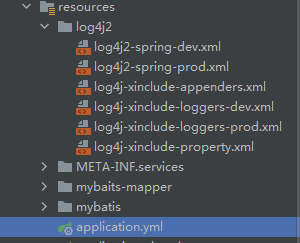

spring boot 版本 `2.5.3`

`pom.xml`依赖如下:

```xml
        <dependency>
            <groupId>org.springframework.boot</groupId>
            <artifactId>spring-boot-starter</artifactId>
            <exclusions>
                <exclusion>
                    <groupId>org.springframework.boot</groupId>
                    <artifactId>spring-boot-starter-logging</artifactId>
                </exclusion>
            </exclusions>
        </dependency>

        <dependency> <!-- 引入log4j2依赖 -->
            <groupId>org.springframework.boot</groupId>
            <artifactId>spring-boot-starter-log4j2</artifactId>
        </dependency>

        <dependency>
            <groupId>com.lmax</groupId>
            <artifactId>disruptor</artifactId>
            <version>3.4.2</version>
        </dependency>
```

项目资源目录结构



`applicatio.yml` 增加log4j2配置文件地址

```yaml
logging:
  config: classpath:log4j2/log4j2-spring-dev.xml
```

`log4j2-spring-dev.xml` 配置如下

```xml
<?xml version="1.0" encoding="UTF-8"?>
<configuration xmlns:xi="http://www.w3.org/2001/XInclude"
               status="DEBUG" name="XIncludeDemo">
    <!--常量配置-->
    <xi:include href="log4j-xinclude-property.xml"/>
    <!--appenders-->
    <xi:include href="log4j-xinclude-appenders.xml" />
    <!--loggers-->
    <xi:include href="log4j-xinclude-loggers-dev.xml" />
</configuration>

```

`log4j-xinclude-property.xml`配置 如下:

```xml
<?xml version="1.0" encoding="UTF-8"?>

<properties>
    <!--日志格式-->
    <property name="PATTERN" value="[%-5level] %d{yyyy-MM-dd HH:mm:ss.SSS} %X{TRACE_ID} [%thread]  %logger[%L] - %m%n"/>
    <!--日志编码-->
    <property name="CHARSET" value="utf-8"/>
    <!--单个日志文件大小-->
    <property name="MAX_FILE_SIZE" value="200MB"/>
    <!--日志保存时间-->
    <property name="MAX_HISTORY" value="P10D"/>
    <!--日志根路径-->
    <property name="BASE_LOG_PATH" value="${sys:user.dir}/logs"/>
    <!--日志应用名，例如/data/logs/app/app-info.log 这里引用 ${sys:SERVICE_NAME}  需要在IDEA 增加系统参数 或者java -jar 增加启动参数  例如  -SERVICE_NAME=demo  -->
    <property name="SERVER_NAME" value="${sys:SERVICE_NAME}"/>
    <!-- DefaultRolloverStrategy属性如不设置，则默认为最多同一文件夹下7个文件，这里设置了20 -->
    <property name="DEFAULT_ROLLOVER_STRATEGY" value="20"/>
</properties>

```
  
  


`log4j-xinclude-appenders.xml` 配置如下(定义appender输出细节):

```xml

<?xml version="1.0" encoding="UTF-8"?>

<appenders>
    <Console name="CONSOLE" target="SYSTEM_OUT">
        <PatternLayout pattern="${PATTERN}" charset="${CHARSET}"/>
    </Console>

    <RollingRandomAccessFile name="FILE-DEBUG"
                             fileName="${BASE_LOG_PATH}/${SERVER_NAME}/${SERVER_NAME}-debug.log"
                             filePattern="${BASE_LOG_PATH}/${SERVER_NAME}/bak/${SERVER_NAME}-debug.%d{yyyy-MM-dd}-%i.log.gz">
        <!--
            minLevel：最小日志级别
            maxLevel：最大日志级别
            onMatch：匹配成功接收
            onMismatch：匹配失败丢弃

            onMatch="ACCEPT"匹配该级别及以上级别;
            onMatch="DENY"不匹配该级别及以上级别;
            onMismatch="ACCEPT" 表示匹配该级别以下的级别;
            onMismatch="DENY" 表示不匹配该级别以下的级别;
            
            只输出DEBUG日志。其余日志不输出
        -->
        <ThresholdFilter level="ERROR" onMatch="DENY" onMismatch="NEUTRAL"/>
        <ThresholdFilter level="WARN" onMatch="DENY" onMismatch="NEUTRAL"/>
        <ThresholdFilter level="INFO" onMatch="DENY" onMismatch="NEUTRAL"/>
        <ThresholdFilter level="DEBUG" onMatch="ACCEPT" onMismatch="DENY"/>
        <!--
            pattern：日志格式
            charset：日志字符编码
        -->
        <PatternLayout pattern="${PATTERN}" charset="${CHARSET}" />
        <Policies>
            <!--每天滚动一次-->
            <TimeBasedTriggeringPolicy interval="1"/>
            <!--或者日志达到10KB 滚动一次-->
            <SizeBasedTriggeringPolicy size="100MB"/>

            <DefaultRolloverStrategy max="${DEFAULT_ROLLOVER_STRATEGY}"/>
        </Policies>
        <!--日志删除策略-->
        <DefaultRolloverStrategy fileIndex="nomax">
            <Delete basePath="${BASE_LOG_PATH}/${SERVER_NAME}/bak" maxDepth="3">
                <IfFileName glob="*-debug.*.log.gz"/>
                <IfLastModified age="P10D"/>
            </Delete>
        </DefaultRolloverStrategy>
    </RollingRandomAccessFile>

    <!--
    name：FILE-INFO  appender 名字可以自定义，logger引用使用
    fileName：当前日志名称，如果是多级目录，则会自动创建
    filePattern：归档日志格式
    -->
    <RollingRandomAccessFile name="FILE-INFO"
                             fileName="${BASE_LOG_PATH}/${SERVER_NAME}/${SERVER_NAME}-info.log"
                             filePattern="${BASE_LOG_PATH}/${SERVER_NAME}/bak/${SERVER_NAME}-info.%d{yyyy-MM-dd}-%i.log.gz">
        <!--
            minLevel：最小日志级别
            maxLevel：最大日志级别
            onMatch：匹配成功接收
            onMismatch：匹配失败丢弃
        -->
        <ThresholdFilter level="ERROR" onMatch="DENY" onMismatch="NEUTRAL"/>
        <ThresholdFilter level="WARN" onMatch="DENY" onMismatch="NEUTRAL"/>
        <ThresholdFilter level="INFO" onMatch="ACCEPT" onMismatch="DENY"/>
        <!--
            pattern：日志格式
            charset：日志字符编码
        -->
        <PatternLayout pattern="${PATTERN}" charset="${CHARSET}" />
        <Policies>
            <!--每天滚动一次-->
            <TimeBasedTriggeringPolicy interval="1"/>
            <!--或者日志达到10KB 滚动一次-->
            <SizeBasedTriggeringPolicy size="100MB"/>

            <DefaultRolloverStrategy max="${DEFAULT_ROLLOVER_STRATEGY}"/>
        </Policies>
        <!--日志删除策略-->
        <DefaultRolloverStrategy fileIndex="nomax">
            <Delete basePath="${BASE_LOG_PATH}/${SERVER_NAME}/bak" maxDepth="3">
                <IfFileName glob="*-info.*.log.gz"/>
                <IfLastModified age="P10D"/>
            </Delete>
        </DefaultRolloverStrategy>
    </RollingRandomAccessFile>

    <RollingRandomAccessFile name="FILE-WARN"
                             fileName="${BASE_LOG_PATH}/${SERVER_NAME}/${SERVER_NAME}-warn.log"
                             filePattern="${BASE_LOG_PATH}/${SERVER_NAME}/bak/${SERVER_NAME}-warn.%d{yyyy-MM-dd}-%i.log.gz">
        <!--
            minLevel：最小日志级别
            maxLevel：最大日志级别
            onMatch：匹配成功接收
            onMismatch：匹配失败丢弃
        -->
        <ThresholdFilter level="ERROR" onMatch="DENY" onMismatch="NEUTRAL"/>
        <ThresholdFilter level="WARN" onMatch="ACCEPT" onMismatch="DENY"/>
        <!--
            pattern：日志格式
            charset：日志字符编码
        -->
        <PatternLayout pattern="${PATTERN}" charset="${CHARSET}" />
        <Policies>
            <!--每天滚动一次-->
            <TimeBasedTriggeringPolicy interval="1"/>
            <!--或者日志达到10KB 滚动一次-->
            <SizeBasedTriggeringPolicy size="100MB"/>
            <DefaultRolloverStrategy max="${DEFAULT_ROLLOVER_STRATEGY}"/>
        </Policies>
        <!--日志删除策略-->
        <DefaultRolloverStrategy fileIndex="nomax">
            <Delete basePath="${BASE_LOG_PATH}/${SERVER_NAME}/bak" maxDepth="3">
                <IfFileName glob="*-warn.*.log.gz"/>
                <IfLastModified age="P10D"/>
            </Delete>
        </DefaultRolloverStrategy>
    </RollingRandomAccessFile>


    <RollingRandomAccessFile name="FILE-ERROR"
                             fileName="${BASE_LOG_PATH}/${SERVER_NAME}/${SERVER_NAME}-error.log"
                             filePattern="${BASE_LOG_PATH}/${SERVER_NAME}/bak/${SERVER_NAME}-error.%d{yyyy-MM-dd}-%i.log.gz">
        <ThresholdFilter level="ERROR" onMatch="ACCEPT" onMismatch="DENY"/>
        <PatternLayout pattern="${PATTERN}" charset="${CHARSET}" />
        <Policies>
            <!--每天滚动一次-->
            <TimeBasedTriggeringPolicy interval="1"/>
            <!--或者日志达到10KB 滚动一次-->
            <SizeBasedTriggeringPolicy size="100MB"/>
            <DefaultRolloverStrategy max="${DEFAULT_ROLLOVER_STRATEGY}"/>
        </Policies>
        <!--日志删除策略-->
        <!--DefaultRolloverStrategy 默认的max=7 代表的是dd（天）最多产生7个文件，多余自动删除，但是我们会自己定义删除策略所以要屏蔽这个配置，如果不屏蔽这个配置，则当天日志最多只有7个 -->
        <!--源码：org.apache.logging.log4j.core.appender.rolling.DefaultRolloverStrategy.Builder.build ，当fileIndex=nomax，不在使用max变量 -->
        <DefaultRolloverStrategy fileIndex="nomax">
            <!--basePath：从此处扫描需要删除的日志基本路径，maxDepth:要访问的日志目录最大级别数，默认是1  -->
            <!--例如我们的日志是/data/logs/app/app-info.log，basePath=/data/logs,maxDepth=2 恰好能访问到app-info.log -->
            <Delete basePath="${BASE_LOG_PATH}/${SERVER_NAME}/bak" maxDepth="3">
                <!--删除，正则匹配到文件名-->
                <IfFileName glob="*-error.*.log.gz"/>
                <!--删除，日志距离现在多长事件，P1D代表是1天-->
                <!--http://logging.apache.org/log4j/2.x/log4j-core/apidocs/org/apache/logging/log4j/core/appender/rolling/action/Duration.html-->
                <IfLastModified age="P10D"/>
            </Delete>
        </DefaultRolloverStrategy>
    </RollingRandomAccessFile>


    <RollingRandomAccessFile name="FILE-ALL"
                             fileName="${BASE_LOG_PATH}/${SERVER_NAME}/${SERVER_NAME}-all.log"
                             filePattern="${BASE_LOG_PATH}/${SERVER_NAME}/bak/${SERVER_NAME}-all.%d{yyyy-MM-dd}-%i.log.gz">
        <ThresholdFilter level="ALL" onMatch="ACCEPT" onMismatch="ACCEPT"/>
        <PatternLayout pattern="${PATTERN}" charset="${CHARSET}" />
        <Policies>
            <!--每天滚动一次-->
            <TimeBasedTriggeringPolicy interval="1"/>
            <!--或者日志达到10KB 滚动一次-->
            <SizeBasedTriggeringPolicy size="100MB"/>
            <DefaultRolloverStrategy max="${DEFAULT_ROLLOVER_STRATEGY}"/>
        </Policies>
        <!--日志删除策略-->
        <!--DefaultRolloverStrategy 默认的max=7 代表的是dd（天）最多产生7个文件，多余自动删除，但是我们会自己定义删除策略所以要屏蔽这个配置，如果不屏蔽这个配置，则当天日志最多只有7个 -->
        <!--源码：org.apache.logging.log4j.core.appender.rolling.DefaultRolloverStrategy.Builder.build ，当fileIndex=nomax，不在使用max变量 -->
        <DefaultRolloverStrategy fileIndex="nomax">
            <!--basePath：从此处扫描需要删除的日志基本路径，maxDepth:要访问的日志目录最大级别数，默认是1  -->
            <!--例如我们的日志是/data/logs/app/app-info.log，basePath=/data/logs,maxDepth=2 恰好能访问到app-info.log -->
            <Delete basePath="${BASE_LOG_PATH}/${SERVER_NAME}/bak" maxDepth="3">
                <!--删除，正则匹配到文件名-->
                <IfFileName glob="*-all.*.log.gz"/>
                <!--删除，日志距离现在多长事件，P1D代表是1天-->
                <!--http://logging.apache.org/log4j/2.x/log4j-core/apidocs/org/apache/logging/log4j/core/appender/rolling/action/Duration.html-->
                <IfLastModified age="P3D"/>
            </Delete>
        </DefaultRolloverStrategy>
    </RollingRandomAccessFile>


</appenders>

```


`log4j-xinclude-loggers-dev.xml` 配置如下(哪些包需要打印日志,以及在什么情况下打印日志):

```xml
<?xml version="1.0" encoding="UTF-8"?>
<loggers>
    <AsyncRoot level="INFO" includeLocation="true" >
        <AppenderRef ref="CONSOLE"/>
    </AsyncRoot>
    <!-- 配置需要打印日志的包名 -->
    <AsyncLogger name="com.xxx" level="DEBUG" includeLocation="true" additivity="false">
        <appender-ref ref="FILE-ALL"/>
    </AsyncLogger>

    <AsyncLogger name="druid.sql.Statement" level="DEBUG" additivity="false" includeLocation="true" >
        <appender-ref ref="CONSOLE"/>
        <appender-ref ref="FILE-DEBUG"/>
    </AsyncLogger>
</loggers>
```

