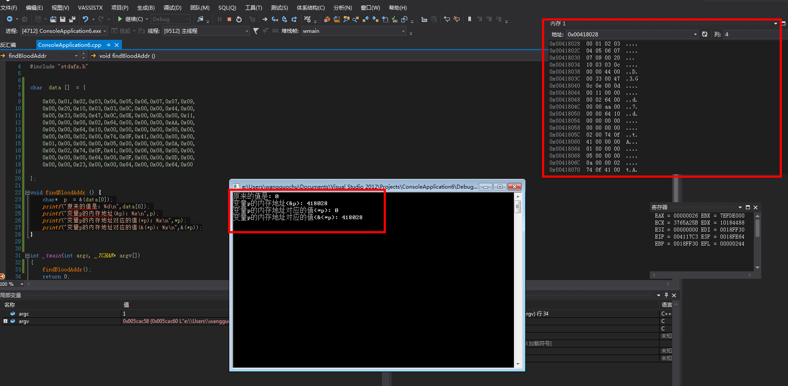

C中 *****的理解


### `*`部分

```c++
// ConsoleApplication4.cpp : 定义控制台应用程序的入口点。
//

#include "stdafx.h"

void function1(){
	char**** a ;
	short**** b;
	int**** c;
	a = (char****)100;
	b = (short****)100;
	c = (int****)100;
	a = a+ 5;
	b= b+ 5;
	c= c+ 5; 
	// 100+(数据宽度*5)   = 100 + (4*5)
	printf("%d,%d,%d",a,b,c);
}

void function2(){
	char**** a ;
	short**** b;
	int**** c;
	a = (char****)100;
	b = (short****)100;
	c = (int****)100;
	a = a-5;
	b= b- 5;
	c= c- 5; 
	// 100-(数据宽度*5)   = 100 - (4*5)
	printf("%d,%d,%d",a,b,c);
}


struct Student
{
	int x ;
	int y ;
};


void function3 () {
	Student** s;
	s = (Student**)100;
	s++; //把s当成4个字节的类型看待  还是按照之前的加法公式 100+(数据宽度*加的数) = 100+(4*1) = 104
	printf("%d\n",s);

	s = (Student**)100;
	s = s+5; // 100+(4*5) = 120
	printf("%d\n",s);
}


void function4(){
	int* a = (int*)100;
	int* b = (int*)50;
	int c = a - b; // 都是*类型。先相减 再除以数据宽度 (100-50)/4 
	printf("%d",c);
}

void function5(){
	char* a = (char*)100;
	char* b = (char*)50;
	int c = a - b; // 都是*类型。先相减 再除以数据宽度 (100-50)/1 
	printf("%d",c);
}


int _tmain(int argc, _TCHAR* argv[])
{
	//function1();
	//function2();
	//function3();
	//function4();
	function5();
	return 0;
}


```


`&`部分

C代码：

定义一个全局变量 char 数组（这里的思考。全局变量会直接分配内存空间） 

```c
char  data []  = {
	0x00,0x01,0x02,0x03,0x04,0x05,0x06,0x07,0x07,0x09,					
	0x00,0x20,0x10,0x03,0x03,0x0C,0x00,0x00,0x44,0x00,					
	0x00,0x33,0x00,0x47,0x0C,0x0E,0x00,0x0D,0x00,0x11,					
	0x00,0x00,0x00,0x02,0x64,0x00,0x00,0x00,0xAA,0x00,					
	0x00,0x00,0x64,0x10,0x00,0x00,0x00,0x00,0x00,0x00,					
	0x00,0x00,0x02,0x00,0x74,0x0F,0x41,0x00,0x00,0x00,					
	0x01,0x00,0x00,0x00,0x05,0x00,0x00,0x00,0x0A,0x00,					
	0x00,0x02,0x74,0x0F,0x41,0x00,0x06,0x08,0x00,0x00,					
	0x00,0x00,0x00,0x64,0x00,0x0F,0x00,0x00,0x0D,0x00,					
	0x00,0x00,0x23,0x00,0x00,0x64,0x00,0x00,0x64,0x00					

};

void findBloodAddr () {
     // &的左右就是取data[0]对应的内存地址
	char*  p  = &(data[0]);
	printf("原来的值是: %d\n",data[0]);  //这里打印的是值 结果为0 
	printf("变量p的内存地址(&p): %x\n",p);  // 这里p = 实际上是 &(data[0])对应的内存地址编号
	printf("变量p的内存地址对应的值(*p): %x\n",*p);  // 打印地址对应的值 结果为0 
	printf("变量p的内存地址对应的值(&(*p): %x\n",&(*p)); //打印*p对应的内存地址  在这里 &(*p) = p
}


int _tmain(int argc, _TCHAR* argv[])
{
	findBloodAddr();
	return 0;
}


```





这里可以看到控制台打印的地址是 `418028` 。

而地址是 `418028`对应的值也正好是`0`。


内存地址的加法：

```c
void findBloodAddrByChar () {
	char*  p  = &(data[0]);
	for (int i = 0; i < 100; i++)
	{
		int addr =(int)(p+i);  //这里的p +i    ，要看成 p的基址  +（ i*p的数据宽度）   ，当前p对应的数据类型是char* ,减去一个* ，得到char 。char对应的数据宽度是1 ，所以 p+i 当 i = 1的时候 ，addr= 基址+(1*1)  
		int v = *(p+i);
		printf("下标为:%d ,内存地址为:%x,下标对应的值为:%d  \n ",i,addr,v);
	}
}


void findBloodAddrByShort () {
	short*  p  = (short*)&(data[0]);
	for (int i = 0; i < 50; i++) //每次当成2个字节看待，所以i不能超过50 。超过50了就没意思（取到的是其他的地址）
	{
		//这里的p +i    ，要看成 p的基址  +（ i*p的数据宽度）   ，当前p对应的数据类型是short* ,减去一个* ，得到short 。short对应的数据宽度是2 ，所以 p+i 当 i = 1的时候 ，addr= 基址+(1*2)
		//当i = 49的时候， addr = 基址+(49*2)
		//TODO 不过这里不懂为什么打印*(p+i)的结果 用的是 %x
		printf("下标为:%d ,内存地址为:%x,下标对应的值为:%x  \n ",i,(p+i),*(p+i));
	}
}

```


总结： 当使用内存地址做加法的时候，得到的地址=基址+（加的数字*数据宽度）
