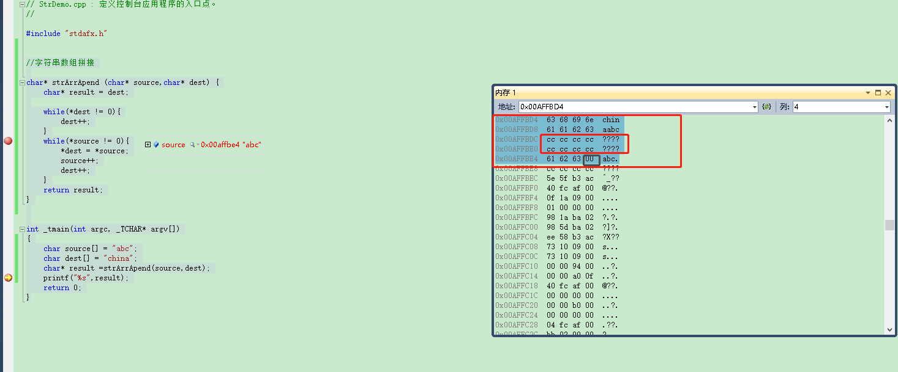

# C语言中的字符串练习


## 获取字符串的长度：

```c
int getstrlen(char* str){

	int count = 0 ;
	while (*(str+count) != 0)
	{
		count++;
	}
	return count;

} 


int _tmain(int argc, _TCHAR* argv[])
{
	char*  str = "china";
	int len = getstrlen(str);
	printf("字符串的长度是:%d",len); // 5
	return 0;
}


```


## 字符串数组合并:

```c
//字符串数组拼接

char* strArrApend (char* source,char* dest) {
    //将要返回的指针进行存储.否则dest的首地址已经移到后面了
	char* result = dest;

    //将指针移动到最后面的位置
	while(*dest != 0){
		dest++;
	}
    
    //如果目标数组的值不等于0(不是最后一个元素)
	while(*source != 0){
        //将目标数组的值给要返回的数组
		*dest = *source;
        //指针向后移动
		source++;
		dest++;
	}
    //注意这里要返回 result。不能返回 dest ，因为dest的指针首地址已经往后移动了几个
	return result;
}


int _tmain(int argc, _TCHAR* argv[])
{
	char source[] = "abc";
	char dest[] = "china";
	char* result =strArrApend(source,dest);
	printf("%s",result); //打印好像有点问题, 看后面的图
    
	return 0;
}
```




正常来说应该打印 `chinaabc`。但是看内存里面的值可知  `0x00AFFBDB`后面指向的地址对应的值不是 0,而是cc(系统默认填充).所以会打印 ` chinaabc烫烫烫烫abc`

