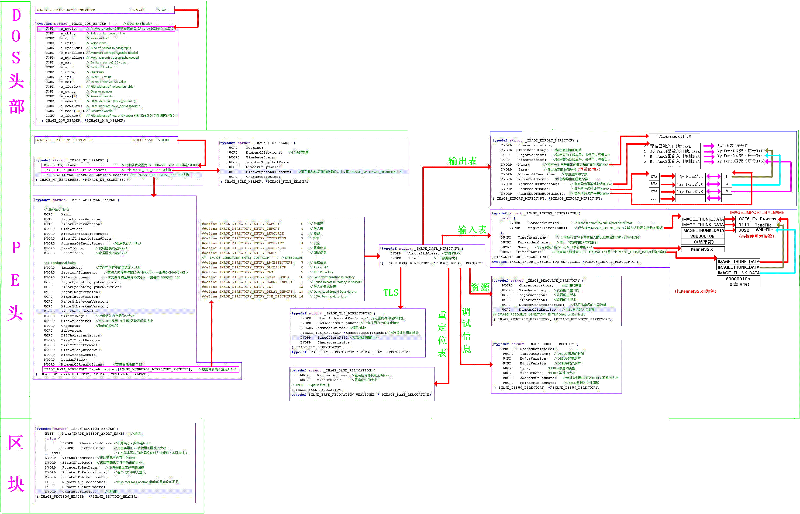

### 图:



### PDF:


### 网站:

[PE文件结构HTML](https://www.mallocfree.com/interview/windows-1-pe.htm)


打印PE结构信息：

```cpp
// PrintPEInfo.cpp : 定义控制台应用程序的入口点。
//

#define _CRT_SECURE_NO_WARNINGS
#include "stdafx.h"
#include <stdlib.h>
#include<windows.h>

int filelength(FILE *fp);
char *readfile(char *path);
int length;


char* offset(char* fileBuffer,int offset){
	return fileBuffer+offset;
}


void printDos(char* fileBuffer){
	printf("=========================DOC头=========================\n\n\n");
	char* tmpFileBuffer = fileBuffer;
	printf("MZ标记：%c%c\n",*(tmpFileBuffer),*(tmpFileBuffer+1));
	tmpFileBuffer = offset(tmpFileBuffer,60);
	printf("PE文件签名的偏移地址(E_lfanew):0x%x",*((int*)(tmpFileBuffer)));
	printf("\n\n\n=========================DOC头=========================");
}


char *readfile(char *path)
{
	FILE *fp;

	char *ch;
	if((fp=fopen(path,"r"))==NULL)
	{
		printf("open file %s error.\n",path);
		exit(0);
	}
	length=filelength(fp);
	ch=(char *)malloc(length);
	fread(ch,length,1,fp);
	*(ch+length-1)='\0';

	printDos(ch);
	
	return ch;
}

int filelength(FILE *fp)
{
	int num;
	fseek(fp,0,SEEK_END);
	num=ftell(fp);
	fseek(fp,0,SEEK_SET);
	return num;
}


int _tmain(int argc, _TCHAR* argv[])
{
	FILE *fp;
	char *string;
	char* fileBuffer =readfile("c:/fg.exe");
	printDos(fileBuffer);

	return 0;
}
```


| 1、DOC头：                           |                                                              |
| ------------------------------------ | ------------------------------------------------------------ |
| WORD   e_magic                *      | "MZ标记" 用于判断是否为可执行文件.                           |
| DWORD  e_lfanew;              *      | PE头相对于文件的偏移，用于定位PE文件                         |
|                                      |                                                              |
| 2、标准PE头：                        |                                                              |
| WORD    Machine;              *      | 程序运行的CPU型号：0x0 任何处理器/0x14C 386及后续处理器      |
| WORD    NumberOfSections;     *      | 文件中存在的节的总数,如果要新增节或者合并节 就要修改这个值.  |
| DWORD   TimeDateStamp;        *      | 时间戳：文件的创建时间(和操作系统的创建时间无关)，编译器填写的. |
| DWORD   PointerToSymbolTable;        |                                                              |
| DWORD   NumberOfSymbols;             |                                                              |
| WORD    SizeOfOptionalHeader; *      | 可选PE头的大小，32位PE文件默认E0h 64位PE文件默认为F0h  大小可以自定义. |
| WORD    Characteristics;      *      | 每个位有不同的含义，可执行文件值为10F 即0 1 2 3 8位置1       |
|                                      |                                                              |
| 3、可选PE头：                        |                                                              |
| WORD    Magic;        *              | 说明文件类型：10B 32位下的PE文件     20B 64位下的PE文件      |
| BYTE    MajorLinkerVersion;          |                                                              |
| BYTE    MinorLinkerVersion;          |                                                              |
| DWORD   SizeOfCode;*                 | 所有代码节的和，必须是FileAlignment的整数倍 编译器填的  没用 |
| DWORD   SizeOfInitializedData;*      | 已初始化数据大小的和,必须是FileAlignment的整数倍 编译器填的  没用 |
| DWORD   SizeOfUninitializedData;*    | 未初始化数据大小的和,必须是FileAlignment的整数倍 编译器填的  没用 |
| DWORD   AddressOfEntryPoint;*        | 程序入口                                                     |
| DWORD   BaseOfCode;*                 | 代码开始的基址，编译器填的   没用                            |
| DWORD   BaseOfData;*                 | 数据开始的基址，编译器填的   没用                            |
| DWORD   ImageBase;*                  | 内存镜像基址                                                 |
| DWORD   SectionAlignment;*           | 内存对齐                                                     |
| DWORD   FileAlignment;*              | 文件对齐                                                     |
| WORD    MajorOperatingSystemVersion; |                                                              |
| WORD    MinorOperatingSystemVersion; |                                                              |
| WORD    MajorImageVersion;           |                                                              |
| WORD    MinorImageVersion;           |                                                              |
| WORD    MajorSubsystemVersion;       |                                                              |
| WORD    MinorSubsystemVersion;       |                                                              |
| DWORD   Win32VersionValue;           |                                                              |
| DWORD   SizeOfImage;*                | 内存中整个PE文件的映射的尺寸，可以比实际的值大，但必须是SectionAlignment的整数倍 |
| DWORD   SizeOfHeaders;*              | 所有头+节表按照文件对齐后的大小，否则加载会出错              |
| DWORD   CheckSum;*                   | 校验和，一些系统文件有要求.用来判断文件是否被修改.           |
| WORD    Subsystem;                   |                                                              |
| WORD    DllCharacteristics;          |                                                              |
| DWORD   SizeOfStackReserve;*         | 初始化时保留的堆栈大小                                       |
| DWORD   SizeOfStackCommit;*          | 初始化时实际提交的大小                                       |
| DWORD   SizeOfHeapReserve;*          | 初始化时保留的堆大小                                         |
| DWORD   SizeOfHeapCommit;*           | 初始化时实践提交的大小                                       |
| DWORD   LoaderFlags;                 |                                                              |
| DWORD   NumberOfRvaAndSizes;*        | 目录项数目                                                   |

网上的课后答案

https://github.com/smallzhong/drip-education-homework