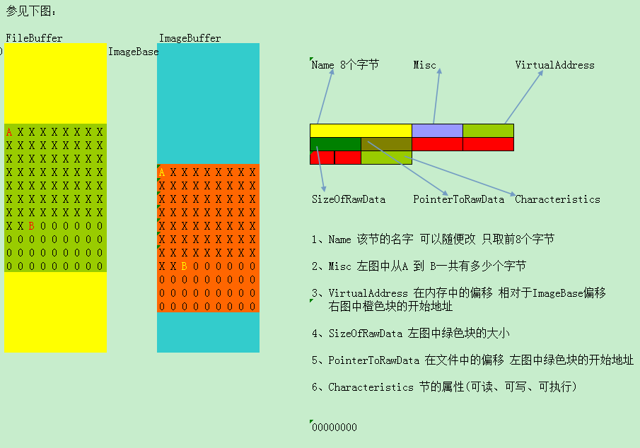

## 打印PE结构信息


节表信息描述

## 

 

代码部分实现逻辑:

```c
// PrintPEInfo.cpp : 定义控制台应用程序的入口点。

#define _CRT_SECURE_NO_WARNINGS
#include "stdafx.h"
#include <stdlib.h>
#include<windows.h>
#include <stdio.h>
#include <stdlib.h>

int filelength(FILE *fp);
char *readfile(char *path);
int length;


char* offset(char* fileBuffer,int offset){
	return fileBuffer+offset;
}

 int*  getPEDosInfo(char* fileBuffer){
	printf("=========================DOC头开始=========================\n\n\n");
	char* tmpFileBuffer = fileBuffer;
	printf("MZ标记：%c%c\n",*(tmpFileBuffer),*(tmpFileBuffer+1));
	tmpFileBuffer = offset(tmpFileBuffer,60);
	int* lfanew =  (int*)(tmpFileBuffer);
	printf("PE文件签名的偏移地址(E_lfanew):0x%x",*(lfanew));
	printf("\n\n\n=========================DOC头结束=========================\n\n\n");
	return lfanew;

}

 bool is32Exe =  true;
 unsigned short NumberOfSectionsV = 0;
 //占20个字节
 short* getNTInfo (char* fileBuffer ,int* lfanew ) {
	 char* fileBufferTmp = fileBuffer;
	 printf("\n\n\n=========================NT头开始=========================\n\n\n");

	 int* ntP = (int*)( fileBufferTmp + *(lfanew)); //最重要的一点，这里需要用基址+地址偏移 才能得到NT头的地址 ,如果用ulredit打开fg.exe，那么lfanew是E8，基址是0，所以加不加意义不大，但是这是用内存的方式打开的fg.exe ，内存的基址是有意义的！
	 printf("PE标识:%x\n",*(ntP));

	 short* Machine = (short*)((int*)ntP +1);// short 数据宽度为2 ，这里+1 其实是往后偏移了2*1=2个字节
	 printf("Machine(机器数):%x\n",*(Machine));

	 short* NumberOfSections = Machine +1;
	 printf("NumberOfSections(节数):%d\n",*(NumberOfSections));
	 NumberOfSectionsV = *(NumberOfSections);
	 int*  TimeDateStamp=(int*)(NumberOfSections +1);
	 printf("TimeDateStamp(时间/日期标记):%d\n",*(TimeDateStamp));


	 short*  SizeOfOptionalHeader=(short*)(TimeDateStamp +3);
	  printf("SizeOfOptionalHeader(可选头大小):%d",*(SizeOfOptionalHeader));
	  if (*(SizeOfOptionalHeader) == 224)
	  {
		   printf("(32位机器)\n");
	  }else{
		   is32Exe = false;
		   printf("(64位机器)\n");
	  }
	 
	  short*  FillCharacteristics=SizeOfOptionalHeader+1;
	  printf("FillCharacteristics(文件特征值	):%x\n",*(FillCharacteristics));

	  printf("\n\n\n=========================NT头结束=========================\n\n\n");
	  
	  return FillCharacteristics+1;
 }

 int* ImageBase  ;
 int* SizeOfHeaders ;
 int* SizeOfImage ;
 void getOptionHead(short* optionHeadP){
	 printf("\n\n\n=========================IMAGE_OPTIONAL_HEADER32 (可选映像头)开始=========================\n\n\n");
	 printf("Magic(魔数):%x\n",*(optionHeadP));
	 printf("\t这个无符号整数指出了镜像文件的状态。\n");
	 printf("\t0x10B表明这是一个32位镜像文件。\n");
	 printf("\t0x107表明这是一个ROM镜像。\n");
	 printf("\t0x20B表明这是一个64位镜像文件。\n");
	
	 char* MajorLinkerVersion = (char*)(optionHeadP+1);
	 printf("MajorLinkerVersion(链接器的主版本号):%d\n",*(MajorLinkerVersion));

	 char* MinorLinkerVersion = MajorLinkerVersion+1;
	 printf("MinorLinkerVersion(链接器的次版本号):%d\n",*(MinorLinkerVersion));

	 int* SizeOfCode = (int*)(MinorLinkerVersion+1);
	 printf("SizeOfCode(代码节大小):%d\n",*(SizeOfCode));

	 int* SizeOfInitializedData = (int*)(SizeOfCode+1);
	 printf("SizeOfInitializedData(已初始化数大小):%d\n",*(SizeOfInitializedData));

	 int* SizeOfUninitializedData = (int*)(SizeOfInitializedData+1);
	 printf("SizeOfUninitializedData(已初始化数大小):%d\n",*(SizeOfUninitializedData));


	 int* AddressOfEntryPoint = (int*)(SizeOfUninitializedData+1);
	 printf("AddressOfEntryPoint(入口点):%x\n",*(AddressOfEntryPoint));
	 printf("\t当可执行文件被加载进内存时其入口点RVA。对于一般程序镜像来说，它就是启动地址。为0则从ImageBase开始执行。对于dll文件是可选的。\n");

	 int* BaseOfCode = (int*)(AddressOfEntryPoint+1);
	 printf("BaseOfCode(代码基址):%x\n",*(BaseOfCode));

	 int* BaseOfData = (int*)(BaseOfCode+1);
	 printf("BaseOfData(数据基址):%x\n",*(BaseOfData));

	 int* ImageBaseV = (int*)(BaseOfData+1);
	 ImageBase = ImageBaseV;
	 printf("ImageBase(镜像基址):%x\n",*(ImageBaseV));

	 int* SectionAlignment = (int*)(ImageBaseV+(is32Exe?1:2));
	 printf("SectionAlignment(内存对齐):%d\n",*(SectionAlignment));

	 int* FileAlignment = (int*)(SectionAlignment+1);
	 printf("FileAlignment(文件对齐):%d\n",*(FileAlignment));


	 short* MajorOperatingSystemVersion = (short*)(FileAlignment+1);
	 printf("MajorOperatingSystemVersion(主系统的主版本号):%x\n",*(MajorOperatingSystemVersion));

	 short* MinorOperatingSystemVersion = (short*)(MajorOperatingSystemVersion+1);
	 printf("MinorOperatingSystemVersion(主系统的次版本号):%x\n",*(MinorOperatingSystemVersion));

	 short* MajorImageVersion = (short*)(MinorOperatingSystemVersion+1);
	 printf("MajorImageVersion(镜像的主版本号):%x\n",*(MajorImageVersion));


	 short* MinorImageVersion = (short*)(MajorImageVersion+1);
	 printf("MinorImageVersion(镜像的次版本号):%x\n",*(MinorImageVersion));


	 short* MajorSubsystemVersion = (short*)(MinorImageVersion+1);
	 printf("MajorSubsystemVersion(子系统的主版本号):%x\n",*(MajorSubsystemVersion));


	 short* MinorSubsystemVersion = (short*)(MajorSubsystemVersion+1);
	 printf("MinorSubsystemVersion(子系统的次版本号):%x\n",*(MinorSubsystemVersion));

	 int* Win32VersionValue = (int*)(MinorSubsystemVersion+1);
	 printf("Win32VersionValue(保留，必须为0):%x\n",*(Win32VersionValue));

	 int* SizeOfImageV = (int*)(Win32VersionValue+1);
	 SizeOfImage = SizeOfImageV;
	 printf("SizeOfImage(镜像大小):%x\n",*(SizeOfImageV));

	 int* SizeOfHeadersV = (int*)(SizeOfImageV+1);
	 SizeOfHeaders = SizeOfHeadersV;
	 printf("SizeOfHeaders(头大小):%x\n",*(SizeOfHeadersV));

	 int* CheckSum = (int*)(SizeOfHeadersV+1);
	 printf("CheckSum(校验和):%x\n",*(CheckSum));


	 short* Subsystem = (short*)(CheckSum+1);
	 printf("Subsystem(子系统类型):%x\n",*(Subsystem));

	 short* DllCharacteristics = (short*)(Subsystem+1);
	 printf("DllCharacteristics(校验和):%x\n",*(DllCharacteristics));

	 printf("\n\n\n=========================IMAGE_OPTIONAL_HEADER32 (可选映像头)结束=========================\n\n\n");
 }

 char*  sectionTable ; 
 void getSectionTableInfo (char* fileBufferTmp,int* lfanew) {
	 //unsigned int dosHead = 64;
	 printf("\n\n\n=========================节表开始=========================\n\n\n");
	  int* ntP = (int*)( fileBufferTmp + *(lfanew));
	 unsigned int ntHead = 24;
	 unsigned int optionHead =  0; 
	 if (is32Exe)
	 {
		  optionHead = 224;
	 }else{
		 optionHead = 240;
	 }

	 unsigned int offsetVaule = ntHead +optionHead ;
	 char* lfanewCharP = (char*)(ntP);
	 char* sectionTableP =  lfanewCharP + offsetVaule;
	 sectionTable = sectionTableP;
	  for(int i=1; i<=NumberOfSectionsV; i++){
		  printf("\n\t===第%d个节表信息开始===\n",i);
		  char* NameArr= (char*)malloc(9); 
		  NameArr = (char* )sectionTableP;
		  printf("\t\tName(节表名称):");
		  for (int j = 0;j<8;j++)
		  {
			 printf("%c",*NameArr);
			 NameArr++;
		  }
		  printf("\n");
		  int* VirtualSize = (int*)(NameArr);
		  printf("\t\tVirtualSize(文件对齐前的大小):%#x\n",*(VirtualSize));
		  int* VirtualAddress = (int*)(VirtualSize+1);
		  printf("\t\tVirtualAddress(内存中节相对于镜像基址的偏移):%#x\n",*(VirtualAddress));
		  int* SizeOfRawData = (int*)(VirtualAddress+1);
		  printf("\t\tSizeOfRawData(节在文件中对齐后的尺寸):%#x\n",*(SizeOfRawData));
		  int* PointerToRawData = (int*)(SizeOfRawData+1);
		  printf("\t\tPointerToRawData(节区在文件中的偏移):%#x\n",*(PointerToRawData));
		  int* Characteristics = (int*)(SizeOfRawData+5);
		  printf("\t\tCharacteristics(节的属性):%x\n",*(Characteristics));
		  printf("\t===第%d个节表信息结束===\n",i);
			  sectionTableP = sectionTableP+ 40;
	 }
	 printf("\n\n\n=========================节表结束=========================\n\n\n");

 }

//读取文件到流
char *readfile(char *path)
{
	FILE *fp;

	char *ch;
	if((fp=fopen(path,"rb"))==NULL)
	{
		printf("open file %s error.\n",path);
		exit(0);
	}
	//获取文件长度
	length=filelength(fp);
	//分配指定长度的内存
	ch=(char *)malloc(length);
	//读取 fp 到ch 
	fread(ch,length,1,fp);
	*(ch+length-1)='\0';

	
	return ch;
}

int filelength(FILE *fp)
{
	int num;
	fseek(fp,0,SEEK_END);
	num=ftell(fp);
	fseek(fp,0,SEEK_SET);
	return num;
}


void printPeInfoMany(char* fileBuff){
	int* lfanew = getPEDosInfo(fileBuff);
	short* ntHeadLast = getNTInfo(fileBuff,lfanew);
	// 要区分32位还是64位机器。现在取的是32位的结果
	getOptionHead(ntHeadLast);
	getSectionTableInfo(fileBuff,lfanew);
	
}


#include "PEInternet.h"
void PEInternetPrintPE(){
	PEInternet p1;
	p1.PrintPE();
}

/*
1.申请 ImageBase  大小的内存 ，初始化0值
2.copy sizeOfHead  dos+NT+optionhead + dataHead + sectionHead
3.copy 节数据
	通过NT头 中的NumberOfSections 确定 节表数量
	for
		3.1 找到每一个节的地址，找到起始地址 （PointerToRawData） 
		3.2 找到每一个节的数据长度（占用多大的空间） (SizeOfRawData)
		3.3 找到每一个节的内存中偏移 地址 （VirtualAddress ，需要用 申请的内存的起始地址+VirtualAddress 确定地址）
		
*/
void copyFileBuffToImageBuff(char* fileBuffer ) {
	//char* imageBuffer = (char*)malloc(*(char*)(SizeOfImage));
	char* imageBuffer = (char*)malloc(*(SizeOfImage));
	int i = 0;
	for (; i < *(SizeOfHeaders); i++)                             
	{
			imageBuffer[i] = *(fileBuffer+i);
	}
	printf("iiii=",i);
	char* sectionTableTmp =  sectionTable;
	i=0;
	for (; i < NumberOfSectionsV; i++)
	{
		int* VirtualAddress =(int*)(sectionTableTmp+12);
		int* SizeOfRawData =(int*)(VirtualAddress+1);
		int* PointerToRawData =(int*)(SizeOfRawData+1);
		sectionTableTmp = sectionTableTmp + 40;
		char* rva = imageBuffer+*(VirtualAddress);
		int j = 0;
		for (j; j < *(SizeOfRawData); j++)
		{
			rva[j] = *(((char*)PointerToRawData)+j);
		}
		printf("");
	}
	i=0;
}

int _tmain(int argc, _TCHAR* argv[])
{
	//char* str1 =  (char*)malloc(100*sizeof(char));

	//printf("输入程序全路径\n");
	//scanf("%[^\n]", str1); // takes everything before '\n'

	//char* fileBuffer =readfile(str1);
	//char* fileBuffer =readfile("C:/Windows/System32/notepad.exe");
	char* fileBuffer =readfile("C:/fg2.exe");
	char* tmpStream = fileBuffer;
	//打印dos头信息
	printPeInfoMany(tmpStream);
	
    //这里是复制PE结构
	//copyFileBuffToImageBuff(fileBuffer);
	return 0;
}
```

