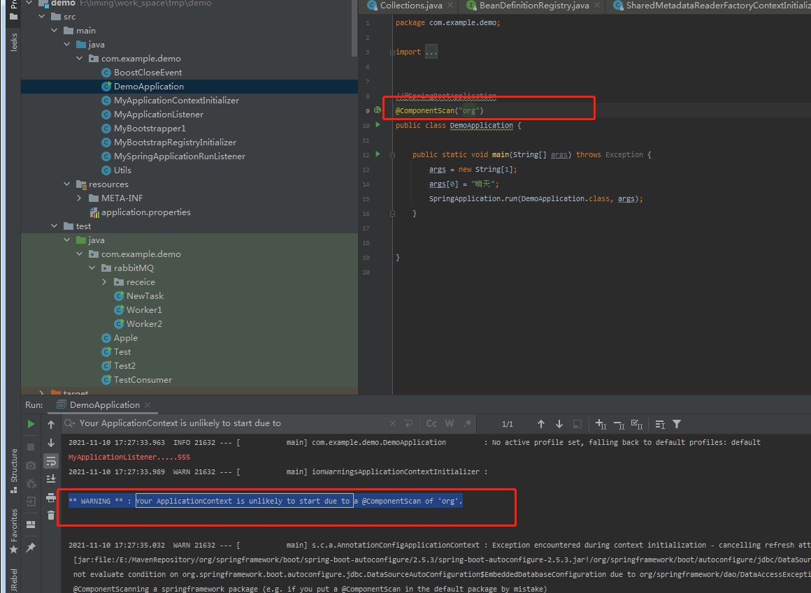

**文章内容如有错误,请提出**

本章内容涉及的内容非常多.postProcess ,getBean

三级缓存等

入口是这3个函数

我们逐一分析

```java
				// Allows post-processing of the bean factory in context subclasses.
				//钩子函数,让子类去实现.这里没有实现逻辑
				postProcessBeanFactory(beanFactory);

				// Invoke factory processors registered as beans in the context.
				//调用工厂处理bean作为上下文				
				invokeBeanFactoryPostProcessors(beanFactory);

				// Register bean processors that intercept bean creation.
				registerBeanPostProcessors(beanFactory);

```


先分析`invokeBeanFactoryPostProcessors(beanFactory);`方法   

```java
protected void invokeBeanFactoryPostProcessors(ConfigurableListableBeanFactory beanFactory) {
//这里使用了委派模式    
    //首先调用 getBeanFactoryPostProcessors() 获取了 beanFactoryPostProcessors
    PostProcessorRegistrationDelegate.invokeBeanFactoryPostProcessors(beanFactory, getBeanFactoryPostProcessors());

   // Detect a LoadTimeWeaver and prepare for weaving, if found in the meantime
   // (e.g. through an @Bean method registered by ConfigurationClassPostProcessor)
   if (!NativeDetector.inNativeImage() && beanFactory.getTempClassLoader() == null && beanFactory.containsBean(LOAD_TIME_WEAVER_BEAN_NAME)) {
      beanFactory.addBeanPostProcessor(new LoadTimeWeaverAwareProcessor(beanFactory));
      beanFactory.setTempClassLoader(new ContextTypeMatchClassLoader(beanFactory.getBeanClassLoader()));
   }
}

public List<BeanFactoryPostProcessor> getBeanFactoryPostProcessors() {
    return this.beanFactoryPostProcessors;
}


//通过类名可知，这个方法主要是调用bean工厂后置处理器
public static void invokeBeanFactoryPostProcessors(
			ConfigurableListableBeanFactory beanFactory, List<BeanFactoryPostProcessor> beanFactoryPostProcessors) {

		// Invoke BeanDefinitionRegistryPostProcessors first, if any.
		Set<String> processedBeans = new HashSet<>();

    	//这里是DefaultListableBeanFactory 。 DefaultListableBeanFactory 也是实现了BeanDefinitionRegistry接口  会走if逻辑
		if (beanFactory instanceof BeanDefinitionRegistry) {
			BeanDefinitionRegistry registry = (BeanDefinitionRegistry) beanFactory;
            //普通的postProcess集合
			List<BeanFactoryPostProcessor> regularPostProcessors = new ArrayList<>();
            //注册postProcess集合
			List<BeanDefinitionRegistryPostProcessor> registryProcessors = new ArrayList<>();
			// 这里  beanFactoryPostProcessors 循环 .调用 如果process 实现了 BeanDefinitionRegistryPostProcessor  ,那么就会调用postProcessBeanDefinitionRegistry方法 并且加入到 registryProcessors列表中 ,否则的话就会把他加到普通的postProcess集合中    
            //beanFactoryPostProcessors 通过DEBUG发现是有两个值的 
            //分别是  org.springframework.boot.autoconfigure.SharedMetadataReaderFactoryContextInitializer$CachingMetadataReaderFactoryPostProcessor
           	 //	org.springframework.boot.context.ConfigurationWarningsApplicationContextInitializer$ConfigurationWarningsPostProcessor
            //不过这里当时DEBUG的时的时候产生了一点疑惑. 是在什么地方把这两个对象放到beanFactoryPostProcessors
            //感兴趣可参考 初探Spring源码,后置处理阶段(5.1).md
			for (BeanFactoryPostProcessor postProcessor  : beanFactoryPostProcessors) {
				if (postProcessor instanceof BeanDefinitionRegistryPostProcessor) {
					BeanDefinitionRegistryPostProcessor registryProcessor =
							(BeanDefinitionRegistryPostProcessor) postProcessor;
                    //beanFactoryPostProcessors 共有两个 。
                    //CachingMetadataReaderFactoryPostProcessor 调用postProcessBeanDefinitionRegistry方法后 
                    	//注册了一个SharedMetadataReaderFactoryBean beandifinition  名字叫做 org.springframework.boot.autoconfigure.internalCachingMetadataReaderFactory  
                    	// 将definition 的属性 propertyValues 增加值 
                    	// propertyValues.add("metadataReaderFactory", new RuntimeBeanReference(BEAN_NAME));
                    //ConfigurationWarningsPostProcessor 主要是检查启动类上面是否有@ComponentScan注解。如果有的话 是否包含org 或者org.springframework 。有的话报错	测试看图1
					registryProcessor.postProcessBeanDefinitionRegistry(registry);
					registryProcessors.add(registryProcessor);
				}
				else {
                    //else 不会进来
					regularPostProcessors.add(postProcessor);
				}
			}

			// Do not initialize FactoryBeans here: We need to leave all regular beans
			// uninitialized to let the bean factory post-processors apply to them!
			// Separate between BeanDefinitionRegistryPostProcessors that implement
			// PriorityOrdered, Ordered, and the rest.
            // 不要在此处初始化 FactoryBeans：我们需要保留所有常规 bean
            // 未初始化以让 bean 工厂后处理器应用于它们！
            // 分离实现的 BeanDefinitionRegistryPostProcessors
            // PriorityOrdered、Ordered 和其他。
			List<BeanDefinitionRegistryPostProcessor> currentRegistryProcessors = new ArrayList<>();

			// First, invoke the BeanDefinitionRegistryPostProcessors that implement PriorityOrdered. 第一步，将后置处理器先进行优先级排序
            //beanFactory.getBeanNamesForType 这个方法暂时没有去研究，不过通过名字可知，应该是通过传入BeanDefinitionRegistryPostProcessor ，找到它的一些实现类。
			String[] postProcessorNames =
					beanFactory.getBeanNamesForType(BeanDefinitionRegistryPostProcessor.class, true, false);
			for (String ppName : postProcessorNames) {
                // 这里既然没有else 那么证明只会取实现了PriorityOrdered接口的postProcess
				if (beanFactory.isTypeMatch(ppName, PriorityOrdered.class)) {
					currentRegistryProcessors.add(beanFactory.getBean(ppName, BeanDefinitionRegistryPostProcessor.class));
					processedBeans.add(ppName);
				}
			}
            //进行排序
			sortPostProcessors(currentRegistryProcessors, beanFactory);
			registryProcessors.addAll(currentRegistryProcessors);
			invokeBeanDefinitionRegistryPostProcessors(currentRegistryProcessors, registry, beanFactory.getApplicationStartup());
			currentRegistryProcessors.clear();

			// Next, invoke the BeanDefinitionRegistryPostProcessors that implement Ordered.
			postProcessorNames = beanFactory.getBeanNamesForType(BeanDefinitionRegistryPostProcessor.class, true, false);
			for (String ppName : postProcessorNames) {
				if (!processedBeans.contains(ppName) && beanFactory.isTypeMatch(ppName, Ordered.class)) {
					currentRegistryProcessors.add(beanFactory.getBean(ppName, BeanDefinitionRegistryPostProcessor.class));
					processedBeans.add(ppName);
				}
			}
			sortPostProcessors(currentRegistryProcessors, beanFactory);
			//在50行registryProcessors也进行了add处理。 一个是入参传入的beanfactorypostprocess 一个是通过getBeanNamesForType 拿到的postProcess
			registryProcessors.addAll(currentRegistryProcessors);
			invokeBeanDefinitionRegistryPostProcessors(currentRegistryProcessors, registry, beanFactory.getApplicationStartup());
			currentRegistryProcessors.clear();

			// Finally, invoke all other BeanDefinitionRegistryPostProcessors until no further ones appear.
			boolean reiterate = true;
			while (reiterate) {
				reiterate = false;
				postProcessorNames = beanFactory.getBeanNamesForType(BeanDefinitionRegistryPostProcessor.class, true, false);
				for (String ppName : postProcessorNames) {
					if (!processedBeans.contains(ppName)) {
						currentRegistryProcessors.add(beanFactory.getBean(ppName, BeanDefinitionRegistryPostProcessor.class));
						processedBeans.add(ppName);
						reiterate = true;
					}
				}
				sortPostProcessors(currentRegistryProcessors, beanFactory);
				registryProcessors.addAll(currentRegistryProcessors);
				invokeBeanDefinitionRegistryPostProcessors(currentRegistryProcessors, registry, beanFactory.getApplicationStartup());
				currentRegistryProcessors.clear();
			}

			// Now, invoke the postProcessBeanFactory callback of all processors handled so far.
			invokeBeanFactoryPostProcessors(registryProcessors, beanFactory);
			invokeBeanFactoryPostProcessors(regularPostProcessors, beanFactory);
		}

		else {
			// Invoke factory processors registered with the context instance.
			invokeBeanFactoryPostProcessors(beanFactoryPostProcessors, beanFactory);
		}

		// Do not initialize FactoryBeans here: We need to leave all regular beans
		// uninitialized to let the bean factory post-processors apply to them!
		String[] postProcessorNames =
				beanFactory.getBeanNamesForType(BeanFactoryPostProcessor.class, true, false);

		// Separate between BeanFactoryPostProcessors that implement PriorityOrdered,
		// Ordered, and the rest.
		List<BeanFactoryPostProcessor> priorityOrderedPostProcessors = new ArrayList<>();
		List<String> orderedPostProcessorNames = new ArrayList<>();
		List<String> nonOrderedPostProcessorNames = new ArrayList<>();
		for (String ppName : postProcessorNames) {
			if (processedBeans.contains(ppName)) {
				// skip - already processed in first phase above
			}
			else if (beanFactory.isTypeMatch(ppName, PriorityOrdered.class)) {
				priorityOrderedPostProcessors.add(beanFactory.getBean(ppName, BeanFactoryPostProcessor.class));
			}
			else if (beanFactory.isTypeMatch(ppName, Ordered.class)) {
				orderedPostProcessorNames.add(ppName);
			}
			else {
				nonOrderedPostProcessorNames.add(ppName);
			}
		}

		// First, invoke the BeanFactoryPostProcessors that implement PriorityOrdered.
		sortPostProcessors(priorityOrderedPostProcessors, beanFactory);
		invokeBeanFactoryPostProcessors(priorityOrderedPostProcessors, beanFactory);

		// Next, invoke the BeanFactoryPostProcessors that implement Ordered.
		List<BeanFactoryPostProcessor> orderedPostProcessors = new ArrayList<>(orderedPostProcessorNames.size());
		for (String postProcessorName : orderedPostProcessorNames) {
			orderedPostProcessors.add(beanFactory.getBean(postProcessorName, BeanFactoryPostProcessor.class));
		}
		sortPostProcessors(orderedPostProcessors, beanFactory);
		invokeBeanFactoryPostProcessors(orderedPostProcessors, beanFactory);

		// Finally, invoke all other BeanFactoryPostProcessors.
		List<BeanFactoryPostProcessor> nonOrderedPostProcessors = new ArrayList<>(nonOrderedPostProcessorNames.size());
		for (String postProcessorName : nonOrderedPostProcessorNames) {
			nonOrderedPostProcessors.add(beanFactory.getBean(postProcessorName, BeanFactoryPostProcessor.class));
		}
		invokeBeanFactoryPostProcessors(nonOrderedPostProcessors, beanFactory);

		// Clear cached merged bean definitions since the post-processors might have
		// modified the original metadata, e.g. replacing placeholders in values...
		beanFactory.clearMetadataCache();
	}
```



#### 图1
